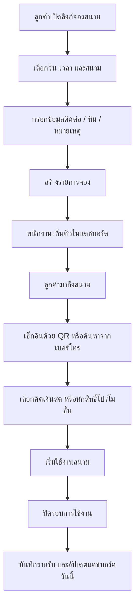

## 1. ภาพรวมผลิตภัณฑ์
ระบบบริหารจัดการสนามฟุตบอลหญ้าเทียมสำหรับเจ้าของกิจการและพนักงาน ใช้จัดการแดชบอร์ด ตารางจองคิว walk-in รายรับ-รายจ่าย โปรโมชั่น และช่องทาง QR/ลิงก์สำหรับลูกค้าและพนักงานในประสบการณ์แบบ Premium App
- ออกแบบให้เป็นโมดูลใหม่ในกลุ่ม 1 ของแพ็กเกจ "1 วันละ 1 บาท" และใช้ภาษาดีไซน์เดียวกับคาร์แคร์ ร้านตัดผม และซักผ้า
- เป้าหมายคือช่วยให้ร้านจัดคิวสนามได้แม่นยำ ลดงานหน้าร้าน เพิ่มความเป็นระเบียบ และทำให้ลูกค้าจอง/เช็กอินใช้งานได้ง่ายบนมือถือ

## 2. ฟีเจอร์หลัก

### 2.1 บทบาทผู้ใช้งาน
| บทบาท | วิธีเข้าใช้งาน | สิทธิ์หลัก |
|------|----------------|------------|
| เจ้าของร้าน | ล็อกอินแดชบอร์ด | ดูทุกเมนู ตั้งค่าร้าน โปรโมชั่น การเงิน QR และรายงาน |
| พนักงาน | ลิงก์/QR พนักงาน | เพิ่มจองคิว walk-in เช็กอินลูกค้า อัปเดตสถานะคิว รับชำระเงิน |
| ลูกค้า | หน้า public booking | ดูช่วงเวลาว่าง จองคิว กรอกข้อมูลทีม/ผู้ติดต่อ และสแกนเช็กอิน |

### 2.2 โมดูลฟีเจอร์
1. **หน้าแดชบอร์ดสนามฟุตบอล**: สถิติวันนี้แบบ Bento Grid, สรุปคิววันนี้, รายได้วันนี้, โปรโมชั่นที่กำลังขาย, สถานะสนามแต่ละคอร์ต
2. **หน้าคิวและการจอง**: ปฏิทิน/ตารางเวลา, รายการจองล่วงหน้า, walk-in, การยืนยันเช็กอิน, การเลื่อนเวลา, การปิดงาน
3. **หน้าการเงิน**: รายรับ, รายจ่าย, สรุปกำไร, ประวัติรายการ, ฟิลเตอร์ช่วงเวลา, modal เพิ่ม/แก้ไขรายการแบบ Glassmorphism
4. **หน้าโปรโมชั่นและแพ็กเกจ**: ขายโปรโมชั่นแบบจำนวนครั้งหรือจำนวนชั่วโมง, ตัดรอบการใช้งาน, ติดตามสิทธิ์คงเหลือ
5. **หน้า QR และลิงก์พนักงาน/ลูกค้า**: QR สำหรับพนักงานบันทึกคิว, ลิงก์ให้ลูกค้าจอง, QR สำหรับเช็กอินหน้างาน
6. **หน้าตั้งค่าร้านและสนาม**: จำนวนสนาม, ช่วงเวลาเปิดบริการ, ราคา weekday/weekend, กติกาทั่วไป และข้อความแนะนำลูกค้า

### 2.3 รายละเอียดหน้า
| ชื่อหน้า | โมดูลย่อย | รายละเอียดฟังก์ชัน |
|---------|-----------|--------------------|
| แดชบอร์ดสนามฟุตบอล | Hero Header | แสดงชื่อร้าน, สถานะเปิดร้าน, ปุ่มลัดเพิ่มคิว walk-in, เปิด QR, ไปหน้าการจอง |
| แดชบอร์ดสนามฟุตบอล | Bento Stats | สรุปจำนวนลูกค้าวันนี้, จำนวนรอบใช้งาน, โปรโมชั่นที่ถูกใช้, รายรับรวม พร้อมไอคอนและสีแยกหมวด |
| แดชบอร์ดสนามฟุตบอล | สนามที่กำลังใช้งาน | การ์ดสนามแต่ละคอร์ต แสดงเวลาเริ่ม-จบ, สถานะ, ผู้จอง, ปุ่มดูรายละเอียด |
| คิวและการจอง | Timeline / Schedule Grid | ดูเวลาว่างรายสนาม, เพิ่มจองล่วงหน้า, บล็อกเวลา, แก้ไขและย้ายคิว |
| คิวและการจอง | Walk-in Queue | เพิ่มลูกค้าโดยไม่จองล่วงหน้า, เลือกสนาม, ระบุช่วงเวลา, เก็บข้อมูลติดต่อ |
| คิวและการจอง | Booking Detail Modal | ดูรายละเอียดการจอง, เช็กอิน, เปลี่ยนสถานะ, แนบโน้ต, รับชำระ |
| การเงิน | Summary Cards | รายรับ, รายจ่าย, กำไร, จำนวนรายการในช่วงที่กรอง |
| การเงิน | รายการรายรับ/รายจ่าย | ประวัติแบบรวมแท็บ, ฟิลเตอร์วันเวลา, ดูรายละเอียด, แก้ไข, ลบ |
| โปรโมชั่น | Promotion Catalog | สร้างแพ็กเล่น 10 ครั้ง, รายเดือน, รายชั่วโมง, ราคาโปรพิเศษ |
| โปรโมชั่น | Usage Tracking | ตัดสิทธิ์เมื่อเข้าใช้, ดูสิทธิ์คงเหลือ, ปิดใช้งานแพ็ก, พิมพ์/แชร์ QR สมาชิก |
| QR และลิงก์ | Staff Portal | หน้าใช้งานเร็วสำหรับพนักงาน: เพิ่มคิว, เช็กอิน, ปิดงาน, เปิดการชำระ |
| QR และลิงก์ | Customer Booking Portal | ลูกค้าดูตารางว่าง จองสนาม กรอกชื่อทีม เบอร์โทร และเลือกเวลา |
| ตั้งค่า | Court Setup | เพิ่ม/แก้ไขชื่อสนาม, ความยาวรอบเวลา, ราคาเริ่มต้น, เวลาเปิด-ปิด |
| ตั้งค่า | Booking Rules | กำหนดเงื่อนไขทั่วไป เช่น มัดจำ, เลทได้กี่นาที, การยกเลิก, เวลาเผื่อทำความสะอาด |

## 3. กระบวนการหลัก
เจ้าของร้านหรือพนักงานสามารถรับจองได้ทั้งจากแดชบอร์ดและจากลูกค้าที่เข้าผ่านลิงก์ public booking โดยคิวทั้งหมดจะถูกรวมอยู่ในมุมมองเดียวกันเพื่อป้องกันการชนกันของเวลา พนักงานสามารถสร้าง walk-in หน้างาน เช็กอินลูกค้า เลือกโปรโมชั่นหรือคิดเงินสด และปิดรอบการใช้งานได้ทันที

ลูกค้าที่มีโปรโมชั่นจะสามารถใช้ QR หรือลิงก์เพื่อยืนยันตัวตนและตัดสิทธิ์ได้ ส่วนฝั่งเจ้าของร้านจะเห็นภาพรวมรายได้-รายจ่ายและสถานะสนามแบบ real-time พร้อมดีไซน์ Glassmorphism v2 และการ์ด Bento ที่อ่านง่ายบนมือถือ

## 4. การออกแบบส่วนติดต่อผู้ใช้
### 4.1 แนวทางดีไซน์
- โทนหลัก: เขียวสนาม + น้ำเงินเข้ม + ขาวโปร่งแสง พร้อม accent สี lime / cyan สำหรับสถานะคิวและโปรโมชั่น
- สไตล์ปุ่ม: ปุ่มมนใหญ่แบบ Premium Action Bar สำหรับ footer ของ modal ใช้งานง่ายบนมือถือ
- ตัวอักษร: หัวข้อหนักแน่น อ่านง่าย, label แบบตัวพิมพ์ใหญ่ขนาดเล็ก (small caps), ตัวเลขแบบ tabular เพื่ออ่านเวลาและยอดเงิน
- เลย์เอาต์: Desktop-first แต่ mobile-adaptive, การ์ด Bento Grid, แผงข้อมูลแบ่งกลุ่มชัดเจน, ซ้าย-ขวาเป็นระเบียบ
- แนวทางไอคอน: ใช้ไอคอนสมัยใหม่ในสไตล์เดียวกับคาร์แคร์และร้านตัดผม เช่น calendar, goal, wallet, timer, users, ticket, qr-code

### 4.2 ภาพรวมดีไซน์รายหน้า
| ชื่อหน้า | โมดูลย่อย | องค์ประกอบ UI |
|---------|-----------|----------------|
| แดชบอร์ดสนามฟุตบอล | Header + Stats | Glassmorphism v2, พื้นหลังไล่เฉดนุ่ม, ปุ่มลัด, Bento cards พร้อมไอคอน |
| แดชบอร์ดสนามฟุตบอล | Court Cards | การ์ดสนามแบบแยกสถานะสี, ตัวเลขเวลาเด่น, ป้ายสถานะชัดเจน |
| คิวและการจอง | Schedule Grid | ตารางช่องเวลาแบบ card-grid อ่านง่าย, drag-less but tap-friendly, mobile stack |
| คิวและการจอง | Form Modal | rounded-[2rem], backdrop-blur-2xl, กลุ่มข้อมูลชัดเจน, footer มาตรฐาน |
| การเงิน | Finance Tabs | โครงเดียวกับคาร์แคร์: รวมรายรับกับรายจ่ายด้วยแท็บเลือก, ฟิลเตอร์สั้นและชัด |
| โปรโมชั่น | Promotion Cards | การ์ดโปรโมชันเด่นด้วย badge, จำนวนสิทธิ์เหลือ, CTA เพิ่ม/ขาย/แก้ไข |
| QR และลิงก์ | Poster / QR Preview | บัตร QR หรือโปสเตอร์พร้อมคัดลอกลิงก์, ปุ่มใหญ่, เหมาะกับการแชร์ให้พนักงาน |

### 4.3 การตอบสนองต่อขนาดหน้าจอ
- Desktop-first โดยจัดข้อมูลเป็นหลายคอลัมน์และ Bento Grid ตามลำดับความสำคัญ
- บนมือถือ Stat Cards ต้องยังคงอ่านง่าย จัดขนาดตัวอักษรและ padding ตามกฎของโปรเจกต์
- Modal, Action Bar, ตารางเวลา และ card list ต้องแตะใช้งานได้สะดวกด้วยนิ้วเดียว
- จัดข้อความซ้าย-ขวาให้เป็นระเบียบ ไม่แน่นหรือดึงดูดสายตามากเกินไป แต่ยังดูทันสมัยและพรีเมียม
