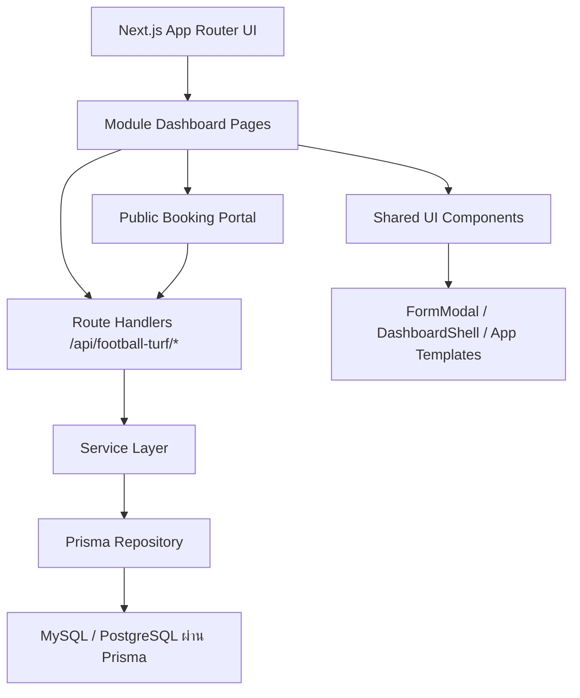
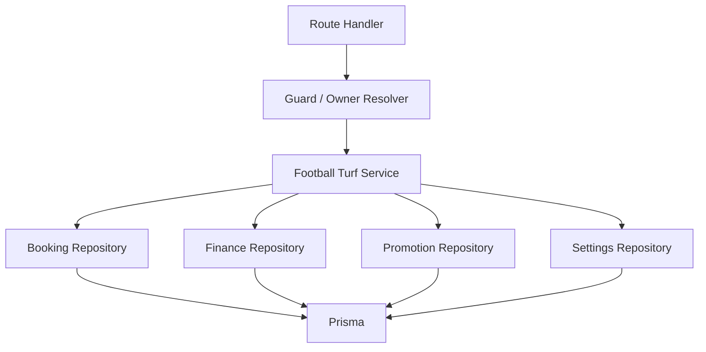
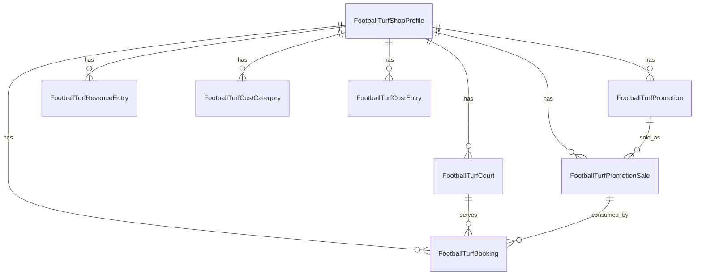

## 1. การออกแบบสถาปัตยกรรม


## 2. รายละเอียดเทคโนโลยี
- Frontend: Next.js App Router + React + TypeScript + Tailwind CSS
- Backend: Next.js Route Handlers ภายใต้ `src/app/api/football-turf/*`
- Data Access: Prisma ผ่าน schema เดียวกับระบบธุรกิจอื่น
- Shared UI: ใช้ `FormModal`, `DashboardShell`, app templates, และ style token เดียวกับคาร์แคร์
- Icons: ใช้ `lucide-react` สำหรับไอคอนใหม่ทั้งหมด
- Module Access: ลงทะเบียนเป็นโมดูลกลุ่ม 1 เพื่อรองรับแพ็ก "1 วันละ 1 บาท"

## 3. นิยามเส้นทาง
| เส้นทาง | วัตถุประสงค์ |
|--------|--------------|
| `/dashboard/football-turf` | หน้าแดชบอร์ดหลักของโมดูลสนามฟุตบอล |
| `/football-turf/book/[ownerId]` | หน้า public booking สำหรับลูกค้าจองสนาม |
| `/football-turf/check-in/[ownerId]` | หน้าเช็กอิน/ยืนยันสิทธิ์ด้วย QR หรือเบอร์โทร |
| `/api/football-turf/dashboard` | ดึงข้อมูลสรุปแดชบอร์ดและสถิติวันนี้ |
| `/api/football-turf/bookings` | สร้าง/แก้ไข/ยกเลิกการจองและ walk-in |
| `/api/football-turf/check-in` | เช็กอินลูกค้า เริ่มใช้งานสนาม ปิดรอบ |
| `/api/football-turf/promotions` | จัดการโปรโมชั่นและสิทธิ์ใช้งาน |
| `/api/football-turf/finance/revenue` | จัดการรายรับ |
| `/api/football-turf/finance/costs` | จัดการรายจ่าย |
| `/api/football-turf/settings` | จัดการข้อมูลสนาม ราคา และกติกา |

## 4. นิยาม API
```ts
type FootballTurfCourt = {
  id: number;
  ownerId: string;
  name: string;
  sortOrder: number;
  isActive: boolean;
  openTime: string;
  closeTime: string;
  defaultSlotMinutes: number;
  weekdayPrice: number;
  weekendPrice: number;
};

type FootballTurfBooking = {
  id: number;
  ownerId: string;
  courtId: number;
  bookingDate: string;
  startAt: string;
  endAt: string;
  customerName: string;
  customerPhone: string;
  teamName: string;
  playerCount: number | null;
  source: "ONLINE" | "WALK_IN" | "STAFF";
  status: "BOOKED" | "CHECKED_IN" | "PLAYING" | "COMPLETED" | "CANCELLED";
  promotionSaleId: number | null;
  listedPrice: number;
  finalPrice: number;
  note: string | null;
};

type FootballTurfPromotion = {
  id: number;
  ownerId: string;
  name: string;
  kind: "COUNT" | "HOUR" | "MONTHLY";
  totalUses: number;
  usedUses: number;
  price: number;
  isActive: boolean;
};

type FootballTurfRevenueEntry = {
  id: number;
  ownerId: string;
  bookingId: number | null;
  promotionSaleId: number | null;
  amount: number;
  paidAt: string;
  paymentMethod: "CASH" | "TRANSFER" | "QR";
  note: string | null;
};

type FootballTurfCostEntry = {
  id: number;
  ownerId: string;
  categoryId: number;
  amount: number;
  spentAt: string;
  itemLabel: string;
  note: string | null;
};
```

## 5. แผนภาพสถาปัตยกรรมฝั่งเซิร์ฟเวอร์


## 6. แบบจำลองข้อมูล
### 6.1 นิยามข้อมูล


### 6.2 นิยามตารางและขอบเขตงาน
- `FootballTurfShopProfile`: โปรไฟล์ร้านสนาม, เวลาเปิด-ปิด, กติกาทั่วไป, ข้อความหน้า public booking
- `FootballTurfCourt`: รายการสนาม, ลำดับการแสดงผล, ราคา weekday/weekend, ความยาวรอบ
- `FootballTurfBooking`: รายการจองทั้งหมดทั้ง online และ walk-in, สถานะคิว, เวลา, ทีม, ผู้ติดต่อ, ราคา
- `FootballTurfPromotion`: ประเภทโปรโมชั่น/แพ็กเล่น
- `FootballTurfPromotionSale`: รายการขายโปรโมชั่นให้ลูกค้า พร้อมสิทธิ์คงเหลือ
- `FootballTurfRevenueEntry`: รายการรับเงินจากการจองหรือขายโปรโมชั่น
- `FootballTurfCostCategory`: หมวดรายจ่าย
- `FootballTurfCostEntry`: รายจ่ายร้าน

DDL ระยะแรกควรยึดแนวทางเดียวกับคาร์แคร์และซักผ้า:
- ใช้ ownerId เป็น logical key หลักในการกรองข้อมูลแต่ละร้าน
- หลีกเลี่ยง physical foreign key หากไม่จำเป็น เพื่อให้สอดคล้องกับแนวทางในโปรเจกต์
- เพิ่ม index ที่ `ownerId`, `bookingDate`, `courtId`, `status`, `customerPhone`
- รองรับ trial seed และ module registration สำหรับ slug ใหม่ `football-turf`

## 7. แนวทางเชื่อมเข้าระบบเดิม
- เพิ่ม slug โมดูลใหม่ใน [config.ts](file:///d:/Ai%20Cluster/src/lib/modules/config.ts) เป็นกลุ่ม 1
- เพิ่ม mapping เส้นทางและการจัดกลุ่ม sidebar ใน [dashboard-nav.ts](file:///d:/Ai%20Cluster/src/lib/dashboard-nav.ts)
- เพิ่มคำอธิบายการ์ดโมดูลใน `dashboard-card-descriptions`
- สร้างหน้า dashboard และ public portal ตามโครงของคาร์แคร์/ซักผ้า
- ใช้ `FormModal` เวอร์ชัน Glassmorphism และ footer มาตรฐานเดียวกับระบบล่าสุด
- เพิ่ม trial seed เพื่อให้โมดูลเปิดใช้งานได้ในระบบทดลองเหมือนโมดูลกลุ่ม 1 อื่น

## 8. ขอบเขตการพัฒนาระยะแรก
- ระยะที่ 1: Dashboard, court setup, booking schedule, walk-in, revenue/cost, promotion sale, QR staff/customer
- ระยะที่ 2: รายงานเชิงลึก, มัดจำออนไลน์, block slot อัตโนมัติ, export รายงาน
