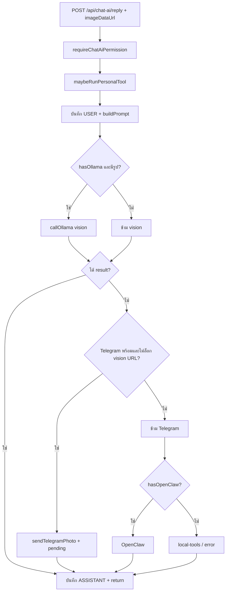

# Chat AI (น้องมาเวล) — เอกสารรวม

คู่มือเดียวสำหรับการตั้งค่า โมเดล เส้นทาง API การส่งรูป การอ่านสลิป การบันทึกบัญชี และตาราง `PersonalAiSlipRecord` ในโปรเจกต์นี้

**หน้าแชท:** `/dashboard/chat-ai` (`/dashboard/chatai` redirect มาที่นี่)  
**ตัวอย่าง env:** `.env.example` ที่รากโปรเจกต์

---

## สารบัญญัติ

- [1. Models, env, API](#1-models-env-api)
- [2. Local vs cloud (`.env` only)](#2-local-vs-cloud-env-only)
- [3. ส่งรูป vs อ่านสลิป (GLM-OCR)](#3-ส่งรูป-vs-อ่านสลิป-glm-ocr)
- [4. Pipeline เซิร์ฟเวอร์: ส่งรูปในแชท](#4-pipeline-เซิร์ฟเวอร์-ส่งรูปในแชท)
- [5. บันทึกรายรับ-รายจ่าย](#5-บันทึกรายรับ-รายจ่าย)
- [6. PersonalAiSlipRecord / parseSlip](#6-personalaisliprecord--parseslip)
- [7. การตั้งค่าแนะนำ](#7-การตั้งค่าแนะนำ)
- [เอกสารอื่นใน `docs/`](#เอกสารอื่นใน-docs)

---

## 1. Models, env, API

สรุปโมเดลที่ดึง (`ollama pull`) ตัวแปร `OLLAMA_*` / OpenClaw และเส้นทาง API

ค่าจริงมาจาก **`process.env` บนเซิร์ฟเวอร์ (Next.js)** เท่านั้น — ไม่มีการเลือกโมเดลจากเบราว์เซอร์

อ้างอิงค่าเริ่มต้นในโค้ด: `src/lib/chat-ai/personal-ai-service.ts`, `src/lib/vision/glm-ocr-service.ts`, `src/lib/home-finance/slip-vision-prompts.ts`

### สรุปด่วน: คำสั่ง `ollama pull`

รันบนเครื่องที่รัน Ollama (หรือเครื่องที่คุณชี้ `OLLAMA_*` ไปหา)

| คำสั่ง | ใช้เมื่อ |
|--------|----------|
| `ollama pull llama3.2:3b` | แชทข้อความ (ดีฟอลต์ในโค้ด ถ้าไม่ตั้ง `OLLAMA_MODEL`) |
| `ollama pull qwen2.5vl:7b` | แชทแนบรูป / vision ทั่วไป (ดีฟอลต์ถ้าไม่ตั้ง `OLLAMA_VISION_MODEL`) |
| `ollama pull glm-ocr:latest` | ปุ่มอ่านสลิป → JSON ก่อนยืนยันบันทึก |
| `ollama pull kimi-k2.5:cloud` | รอบแรกของ pipeline สลิป (ถ้าไม่ตั้ง `OLLAMA_SLIP_SKIP_KIMI=1`) |

### งาน → env → ค่าเริ่มต้นในโค้ด

| งาน | ตัวแปร `env` | ค่าเริ่มต้นโมเดล (ถ้าไม่ตั้ง env) | โค้ดหลัก |
|-----|--------------|-----------------------------------|-----------|
| แชทข้อความ | `OLLAMA_MODEL` + `OLLAMA_API_URL` หรือ `OLLAMA_URL` | `llama3.2:3b` | `callOllama` |
| แชทแนบรูป | `OLLAMA_VISION_MODEL` + `OLLAMA_VISION_API_URL` (หรือ URL เดียวกับข้อความ) | `qwen2.5vl:7b` | `callOllama` + `ollamaCallVisionText` |
| สลิปปุ่มอ่านสลิป (รอบ 1) | `OLLAMA_SLIP_VISION_PRIMARY_*` หรือสำรองจาก API/vision URL | `kimi-k2.5:cloud` | `readSlipWithKimiThenGlmOcr` |
| สลิป (รอง) GLM-OCR | `OLLAMA_GLM_OCR_*` หรือสำรองจาก vision/API URL | `glm-ocr:latest` | `readSlipWithGlmOcr` |
| ข้าม Kimi | `OLLAMA_SLIP_SKIP_KIMI=1` | — | `glm-ocr-service.ts` |
| แชท fallback | `OPENCLAW_AGENT_MODEL` + WS + API key | `openclaw-agent` | `callOpenClawAgent` |

**หมายเหตุ URL:** `OLLAMA_API_URL` มักลงท้าย `/api/generate` ได้ — `ollama-vision.ts` ตัดเป็น base แล้วเรียก `/api/chat` ก่อน ค่อย `/api/generate` สำหรับ vision

### เส้นทาง API

- `POST /api/chat-ai/reply` (alias `POST /api/ai/chat`) → `runPersonalAiChat` — ตรวจ **`requireChatAiPermission`**
- `POST /api/vision/glm-ocr` (alias ใต้ `/api/ai/vision`) → `readSlipWithKimiThenGlmOcr` — ตรวจ **`requireChatAiPermission`**

### รายรับ–รายจ่าย (ไม่ใช่หน้า Chat AI โดยตรง)

`POST` ingest สลิป (`src/app/api/home-finance/entries/ingest-slip/route.ts`) อาจใช้ OpenClaw (`OPENCLAW_API_URL` / `OPENCLAW_URL` + key) หรือ Ollama — ลำดับโมเดล vision: `OLLAMA_VISION_MODEL` → `OLLAMA_MODEL` → ดีฟอลต์ `qwen2.5vl:7b`

---

## 2. Local vs cloud (`.env` only)

เปิด/ปิดและเลือกโลคัล vs คลาวด์ — **ไม่มีสวิตช์ใน UI**  
แอป **ไม่มีปุ่ม** สลับผู้ให้บริการ AI — ควบคุมด้วย **`.env`** และควร **รีสตาร์ทแอป** หลังแก้

- **โลคัล:** ชี้ `OLLAMA_*` ไป Ollama บนเครื่อง/LAN + โมเดลที่ `pull` บนเครื่อง
- **คลาวด์ผ่าน Ollama:** โมเดลชื่อแบบ `:cloud` (เช่น `kimi-k2.5:cloud`) ยังยิงผ่าน URL ของ Ollama ที่ตั้ง
- **ปิดเส้นทาง:** ไม่ใส่ key/URL ที่โค้ดเช็ค — เช่นไม่มี `OPENCLAW_API_KEY` / `OPENCLAW_AGENT_API_KEY` → ไม่เรียก OpenClaw ในแชท

### แชท (`runPersonalAiChat`)

| ต้องการ | `.env` |
|---------|--------|
| ใช้ Ollama เป็นหลัก | `OLLAMA_API_URL` + `OLLAMA_MODEL`; รูป: `OLLAMA_VISION_MODEL` (+ `OLLAMA_VISION_API_URL` ถ้าแยก) |
| ไม่เรียก OpenClaw | เว้นว่าง `OPENCLAW_API_KEY` และ `OPENCLAW_AGENT_API_KEY` |
| ไม่ส่งรูปแชทไป Telegram (fallback) | ตั้ง `OLLAMA_VISION_API_URL` (ตาม logic ล็อกในโค้ด) |
| อนุญาต Telegram เมื่อ Ollama ล้ม | ไม่ล็อกแบบด้านบน + ตั้ง `TELEGRAM_BOT_TOKEN` และ chat id ที่เกี่ยวข้อง |

### ปุ่มอ่านสลิป

| ต้องการ | `.env` |
|---------|--------|
| GLM อย่างเดียว | `OLLAMA_SLIP_SKIP_KIMI=1` |
| ใช้ Kimi รอบแรก | ไม่ตั้ง skip; ตั้ง `OLLAMA_SLIP_VISION_PRIMARY_*` หรือให้สำรองจาก API/vision |

### สูตรตั้งค่า: Ollama โลคัล 100% ฟรี (ไม่ OpenClaw · ไม่ Telegram · ไม่โมเดลคลาวด์)

ใช้เมื่อต้องการให้ Chat AI และปุ่มอ่านสลิปทำงานบนเครื่องคุณเท่านั้น ไม่เรียก OpenClaw ไม่ส่งรูปไป Telegram และไม่ใช้แท็กโมเดลแบบ `:cloud` ของ Ollama

**ก่อนตั้งค่า**

1. ติดตั้ง [Ollama](https://ollama.com) บนเครื่องเดียวกับที่รัน Next.js หรือบนเครื่องใน LAN ที่ **โปรเซส Node เรียกถึงได้** (ถ้า Next อยู่บนเซิร์ฟเวอร์ อย่าใช้ `127.0.0.1` ชี้ไปคนละเครื่อง)
2. รีสตาร์ทแอปหลังแก้ `.env`

**ดึงโมเดลแบบโลคัล (ตัวอย่าง)**

```bash
ollama pull llama3.2:3b
ollama pull qwen2.5vl:7b
ollama pull glm-ocr:latest
```

ไม่ใช้ `kimi-k2.5:cloud` ในสูตรนี้ (ชื่อ `:cloud` มักเป็นเส้นผ่านคลาวด์ของ Ollama)

**ตัวอย่างบล็อก `.env` (ปรับ host ให้ตรงเครื่องคุณ)**

```env
# --- แชท: ข้อความ + รูป (vision) ชุดเดียวกัน ---
OLLAMA_API_URL="http://127.0.0.1:11434/api/generate"
OLLAMA_MODEL="llama3.2:3b"
OLLAMA_VISION_MODEL="qwen2.5vl:7b"
# ตั้งชุด vision เพื่อไม่ให้ส่งสลิปแชทไป Telegram เมื่อ Ollama อ่านรูปได้ และล็อก fallback ตาม logic ในโค้ด
OLLAMA_VISION_API_URL="http://127.0.0.1:11434/api/generate"

# --- ปุ่มอ่านสลิป: ข้าม Kimi เหลือ GLM-OCR บนเครื่อง ---
OLLAMA_SLIP_SKIP_KIMI=1
OLLAMA_GLM_OCR_URL="http://127.0.0.1:11434"
OLLAMA_GLM_OCR_MODEL="glm-ocr:latest"

# --- ปิด OpenClaw (แชท) — อย่าใส่ key ---
# OPENCLAW_API_KEY=
# OPENCLAW_AGENT_API_KEY=

# --- ปิด Telegram (ส่งต่อสลิปจากแชท) — อย่าใส่ token / chat id สำหรับ slip forward ---
# TELEGRAM_BOT_TOKEN=
# TELEGRAM_CHAT_UI_SLIP_CHAT_ID=
# (หรือชื่อตัวแปร slip chat id อื่นที่โปรเจกต์รองรับ)
```

**เช็กลิสต์สั้น ๆ**

| รายการ | การทำ |
|--------|--------|
| ไม่ OpenClaw ในแชท | ไม่ตั้ง `OPENCLAW_API_KEY` และ `OPENCLAW_AGENT_API_KEY` |
| ไม่ Telegram | ไม่ตั้ง `TELEGRAM_BOT_TOKEN` + chat id สำหรับส่งสลิป หรือตั้ง `OLLAMA_VISION_API_URL` ให้ Ollama อ่านรูปแชทได้เพื่อไม่พึ่ง Telegram |
| ไม่คลาวด์ผ่าน Ollama | ใช้โมเดลที่ `pull` แบบโลคัลเท่านั้น; ตั้ง `OLLAMA_SLIP_SKIP_KIMI=1` |
| โมดูลอื่น | `ingest-slip` รายรับ–รายจ่ายอาจใช้ `OPENCLAW_API_URL` แยก — ถ้าต้องการโลคัลทั้งระบบ **อย่าใส่** endpoint OpenClaw สำหรับเส้นนั้นด้วย |

---

## 3. ส่งรูป vs อ่านสลิป (GLM-OCR)

อธิบายพฤติกรรมบนหน้าแชท (`PersonalAiChat`)

| | **ส่งรูป (ปุ่มส่ง / Enter)** | **อ่านสลิป (GLM-OCR) → ยืนยันบันทึก** |
|---|------------------------------|----------------------------------------|
| **จุดประสงค์** | คุยกับน้องมาเวลแบบมีรูป — วิเคราะห์/ถาม | ดึงข้อมูลโครงสร้างจากสลิป แล้ว**ตรวจและยืนยัน**ก่อนบันทึกบัญชี |
| **ปลายทาง** | `POST /api/chat-ai/reply` | `POST /api/vision/glm-ocr` แล้วฟอร์ม → `POST /api/personal-finance` |
| **ผลใน UI** | ข้อความในแชท (อาจ poll Telegram) | แผง `PersonalAiSlipConfirmPanel` |
| **ประวัติแชท** | บันทึก user/assistant ตามปกติ | คำขออ่านสลิปแยกจากลูปแชทหลัก |
| **บันทึกบัญชีอัตโนมัติ** | **ไม่** (ยกเว้นพิมพ์คำสั่ง `บันทึก…`) | **หลังกดยืนยันในฟอร์ม** |

### การส่งรูป (แชทปกติ)

1. รูปอ่านเป็น data URL ในเบราว์เซอร์ (`prepareImageFileForUpload` + `FileReader`)
2. `POST /api/chat-ai/reply` พร้อม `message?`, `imageDataUrl`
3. ลำดับประมาณ: **Ollama vision** → (อาจ) **Telegram** → **OpenClaw** ตาม env  
   ถ้าตั้ง `OLLAMA_VISION_API_URL` จะไม่ใช้ Telegram เป็น fallback สำหรับเส้นทางนี้

### การอ่านสลิป (ปุ่ม)

1. `POST /api/vision/glm-ocr` — `{ imageDataUrl }`
2. ได้ `GlmOcrSlipResult` → ฟอร์ม → `POST /api/personal-finance`

### ควรใช้แบบไหน

- ถาม/อธิบายสลิป ไม่ได้จะลงบัญชีทันที → ส่งรูปในแชท
- ลงรายรับ–รายจ่ายจากสลิปเป็นขั้นตอน → ปุ่ม **อ่านสลิป (GLM-OCR)**

**อ้างอิงโค้ด:** `PersonalAiChat.tsx`, `personal-ai-service.ts`, `glm-ocr/route.ts`, `glm-ocr-service.ts`, `PersonalAiSlipConfirmPanel.tsx`

---

## 4. Pipeline เซิร์ฟเวอร์: ส่งรูปในแชท

เฉพาะกรณีกด **ส่ง** (ไม่ใช่ปุ่ม GLM-OCR)

**จุดเข้า:** `POST /api/chat-ai/reply` — body: `message?`, `imageDataUrl?` (data URL), `sessionId?` — **`requireChatAiPermission`**

### ลำดับเมื่อมี `imageDataUrl`

1. **Session + ประวัติ** — `PersonalChatSession` / `PersonalChatMessage` (สูงสุด 20 ข้อความ)
2. **`maybeRunPersonalTool`** — รายรับ–รายจ่าย / โน้ต / แผน / ค้นหา; ถ้ามีรูป + คีย์เวิร์ดสลิป → สร้าง `PersonalAiSlipRecord` (คิว — ไม่ใช่ GLM เต็มรูปแบบ)
3. **`buildPrompt`** — system + transcript
4. **ผู้ให้บริการ:**  
   - Ollama vision (`ollamaCallVisionText`, preamble OCR ไทย)  
   - Telegram + `PersonalChatMavelSlipPending` (ถ้าเงื่อนไขอนุญาต)  
   - OpenClaw (ถ้ามี key)  
   - `local-tools` หรือ error
5. บันทึกข้อความ ASSISTANT และอัปเดต session

**ไม่ทำ:** ไม่เรียก `readSlipWithKimiThenGlmOcr`; ไม่เรียก `POST /api/personal-finance` อัตโนมัติจากแค่ส่งรูป

### ตัวแปร env ที่เกี่ยวกับรูป

| ตัวแปร | บทบาท |
|--------|--------|
| `OLLAMA_API_URL` / `OLLAMA_URL` | ข้อความ + รูป (ถ้าไม่แยก vision) |
| `OLLAMA_VISION_API_URL` | vision; ถ้าตั้ง = ไม่ fallback Telegram (ตามโค้ด) |
| `OLLAMA_VISION_MODEL` | multimodal |
| `TELEGRAM_*` | ส่งรูปเมื่อเงื่อนไขครบ |
| `OPENCLAW_*` | fallback |

### ไดอะแกรม (ย่อ)



**ไฟล์:** `chat-ai/reply/route.ts`, `personal-ai-service.ts`, `ollama-vision.ts`, `slip-vision-prompts.ts`

---

## 5. บันทึกรายรับ-รายจ่าย

ฟังก์ชันหลัก: **`createHomeFinanceQuickEntry`** (`src/lib/home-finance/quick-entry.ts`) → **`HomeFinanceEntry`** ของเจ้าของบิลลิ่ง (`getModuleBillingContext`)

### เส้นทาง 1: พิมพ์คำสั่งในแชท

ใน `POST /api/chat-ai/reply` → `maybeRunPersonalTool` → `parseFinanceRecordCommand` เช่น

- `บันทึกรายจ่าย 500 บาท ค่ากาแฟ`
- `บันทึกรายรับ 1,000 บาท`
- `บันทึก 100 บาท` (สั้น — ค่าเริ่มรายจ่ายถ้าไม่มีคำว่ารายรับ)
- ท้ายข้อความ: `หมวด …` หรือ `#หมวด`

→ `createHomeFinanceQuickEntry` ด้วย **วันนี้ (Bangkok)** — **ไม่มีฟอร์มยืนยัน**

### เส้นทาง 2: อ่านสลิป + ฟอร์ม

1. `POST /api/vision/glm-ocr`
2. `PersonalAiSlipConfirmPanel` / `buildSlipFormFromGlm`
3. `POST /api/personal-finance` — `date`, `amount`, `type`, `description`, `category`, `note`, `billNumber`, `paymentMethod` (ทางเลือก)

→ **`requireSession`**; เรียก `createHomeFinanceQuickEntry` พร้อมฟิลด์เพิ่ม

### รูปสลิปและหลักฐานแนบ (พฤติกรรมปัจจุบัน)

การบันทึกผ่าน Chat AI (**ทั้งคำสั่งข้อความ** และ **`POST /api/personal-finance`** หลังยืนยันฟอร์มสลิป) ใช้ฟังก์ชัน **`createHomeFinanceQuickEntry`** เท่านั้น ในโค้ดปัจจุบันมีการตั้งค่าคงที่ดังนี้:

- **`slipImageUrl`** = `null`
- **`attachmentUrls`** = `[]` (ว่าง)

ดังนั้น **รูปสลิปจะไม่ถูกเก็บเป็นหลักฐานในรายการรายรับ–รายจ่าย** แม้ผู้ใช้จะอ่านสลิปจากแชทและกดยืนยัน — รูปใน `PersonalAiSlipConfirmPanel` ใช้ให้ตรวจยอด/ข้อความก่อนบันทึกเท่านั้น ไม่ได้ส่ง `imageDataUrl` ไปที่ API บันทึกบัญชี (`PersonalAiChat` → `saveSlipToFinance` ส่งเฉพาะฟิลด์ตัวเลขและข้อความ)

ถ้าต้องการแนบสลิปในระบบบัญชีจริง ๆ:

- ไปที่ **`/dashboard/home-finance`** แล้วสร้างหรือแก้รายการด้วยฟอร์มเต็มที่รองรับอัปโหลดรูป หรือ
- อัปโหลดรูปด้วย **`POST /api/home-finance/upload`** (ได้ `imageUrl`) แล้วสร้างรายการด้วย **`POST /api/home-finance/entries`** พร้อม **`slipImageUrl`** / **`attachmentUrls`** — ตรงกับ flow ในหน้า **`HomeFinanceClient`**

### สิทธิ์

| หัวข้อ | รายละเอียด |
|--------|-------------|
| เซสชัน | `/api/personal-finance` ต้องล็อกอิน |
| แชท / glm-ocr | `requireChatAiPermission` |
| พนักงาน | `createHomeFinanceQuickEntry` → **403** ถ้าเป็น staff |
| เจ้าของรายการ | `ownerUserId` จาก billing context |

### สิ่งที่ไม่ทำอัตโนมัติ

- ส่งรูปแชทอย่างเดียว → ไม่ลงบัญชี (ยกเว้นคำสั่งข้อความ)
- อ่านสลิป → ไม่ลงบัญชีจนกดยืนยัน
- แม้ยืนยันจากฟอร์มสลิปแล้ว → **ยังไม่แนบไฟล์รูป** ลง `HomeFinanceEntry` ผ่านเส้นทาง quick entry (ดูหัวข้อ **รูปสลิปและหลักฐานแนบ** ด้านบน)

**UI:** `/dashboard/chat-ai`, `/dashboard/home-finance`

---

## 6. PersonalAiSlipRecord / parseSlip

ตาราง **`ai_slip_records`** — เก็บ **ข้อมูลอ้างอิงสลิป** ไม่เท่ากับ **`HomeFinanceEntry`** จนกว่าจะใช้ `/api/personal-finance` หรือคำสั่ง `บันทึก…`

### โมเดล (ย่อ)

`userId`, `imageUrl`, `parsedData` (JSON), `amount`, `slipDate`, `category`, เวลา

### เส้นทาง 1: `maybeRunPersonalTool`

- มี `imageDataUrl` + ข้อความตรง `(สลิป|ใบเสร็จ|อ่านรูป|อ่านสลิป)`
- `imageUrl` = `imageDataUrl.slice(0, 2048)`; `parsedData` = คิว `queued for parse`
- **ไม่** เรียก `/api/vision/glm-ocr`; **ไม่** สร้างรายการบัญชี

### เส้นทาง 2: `POST /api/chat-ai/tools` — `tool: "parseSlip"`

- `imageUrl` ต้องเป็น **URL มาตรฐาน** (`z.string().url()`) — **ไม่รองรับ** data URL ใน schema นี้
- ใน repo **ยังไม่มี** client แชทเรียก endpoint นี้

### คำว่า `parseSlip` ใน system prompt

เป็นแนวทางให้โมเดล — ไม่ได้หมายความว่า HTTP ถูกเรียกอัตโนมัติเสมอ

### เทียบกับปุ่ม GLM-OCR

| | `PersonalAiSlipRecord` | ฟอร์ม + `/api/personal-finance` |
|--|------------------------|----------------------------------|
| ตาราง | `ai_slip_records` | `home_finance_entries` |
| จุดประสงค์ | หลักฐาน/คิว | ลงบัญชีหลังยืนยัน |
| OCR โครงสร้าง | ไม่ใช่ path หลัก | Kimi → GLM-OCR |

---

## 7. การตั้งค่าแนะนำ

ดูบล็อก “Chat AI” และ “แชท AI: อ่านสลิป” ใน **`.env.example`** — ตัวแปรถูกอ่านที่ runtime ของ Node เท่านั้น หลังแก้ Prisma/schema ให้รัน `npx prisma generate` ตามขั้นตอนโปรเจกต์

---

## เอกสารอื่นใน `docs/`

- [`TEMPLATE-ระบบย่อย-dashboard.md`](./TEMPLATE-ระบบย่อย-dashboard.md) — เทมเพลตระบบย่อยใต้แดชบอร์ด (ไม่ใช่เฉพาะ Chat AI)
